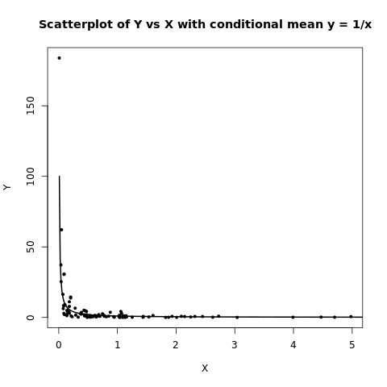
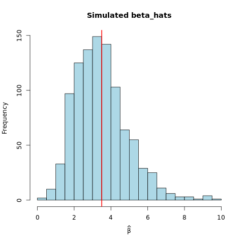

# Data 405 Assignment 3


Recall the joint pdf:
\[
f(x,y)=
\begin{cases}
x e^{-x(1+y)}, & x\ge0,\ y\ge0,[4pt]
0,&\text{otherwise.}
\end{cases}
\]

---

## Q1:
(P(X>1,,Y>1))

The probability that 1 component survives more then 1 unit of time is given by the integral of the density from 1 to infinity, thus:

\[
P(X>1,Y>1)=\int_{x=1}^{\infty}\int_{y=1}^{\infty} x e^{-x(1+y)},dy,dx.
\]

##### Time to solve it:

Step 1: inner integral (over (y)):
\[
\int_{y=1}^{\infty} e^{-x(1+y)},dy
= e^{-x}\int_{1}^{\infty} e^{-x y},dy
= e^{-x}\left[\frac{e^{-xy}}{-x}\right]_{y=1}^{y=\infty}
= e^{-x}\cdot\frac{e^{-x}}{x}
= \frac{e^{-2x}}{x}.
\]

multiply by the factor (x) from the integrand:
\[ x\cdot \frac{e^{-2x}}{x}= e^{-2x}. \]

Now we integrate x from 1 to (inf) -- thats our outer integral:
\[
P(X>1,Y>1)=\int_{1}^{\infty} e^{-2x},dx
= \left[-\tfrac{1}{2}e^{-2x}\right]_{1}^{\infty}
= \frac{1}{2}e^{-2}.
\]

So the probability that both components last at least 1 unit of time is

\[ \boxed
{P(X>1,Y>1)=\dfrac{e^{-2}}{2}.}
\]

---

## Q2:

##### Lets compute the following:
\[
f_X(x)=\int_{0}^{\infty} f(x,y),dy=\int_{0}^{\infty} x e^{-x(1+y)},dy.
\]

First lets factor (x e^{-x}):
\[
f_X(x)=x e^{-x}\int_0^\infty e^{-x y},dy
= x e^{-x}\cdot\frac{1}{x}
= e^{-x},\qquad x\ge0.
\]

so our answer should end up as:
\[ \boxed
{f_X(x)=e^{-x},; x\ge0,} \]
which is an \[(\mathrm{Exp}(1)) \] density function


Thusly, the marginal density of X is:

\[
f_X(x)=\int_{0}^{\infty} x e^{-x(1+y)},dy.
\]

---

## Q3:

By definition,
\[
f_{Y\mid X}(y\mid x)=\frac{f(x,y)}{f_X(x)}
=\frac{x e^{-x(1+y)}}{e^{-x}}
= x e^{-x y},\qquad y\ge0.
\]

So
\[\boxed
{f_{Y\mid X}(y\mid x)=x e^{-x y},; y\ge0.}
\]

Now we compute the conditional expectation:

\[
\mathbb{E}[Y\mid X=x]=\int_0^\infty y , x e^{-x y},dy
= x\int_0^\infty y e^{-x y},dy.
\]

Use the known integral \[(\displaystyle\int_0^\infty y e^{-a y},dy=\frac{1}{a^2})\] for (a>0). Here (a=x), so

\[
\mathbb{E}[Y\mid X=x]=x\cdot\frac{1}{x^2}=\frac{1}{x}
\]

Thus
\[ \boxed
{\mathbb{E}[Y\mid X=x]=\dfrac{1}{x}.}
\]

---

## Q4:


##### Lets compute the following:


\[f_Y(y)=\int_{0}^{\infty} x e^{-x(1+y)},dx.\]

If (a=1+y>0) -- -- our integral becomes

\[\int_0^\infty x e^{-a x},dx.\]

A standard integral (or integrate by parts) gives

\[\int_0^\infty x e^{-a x},dx = \frac{1}{a^2}.\]

Thus with (a=1+y),

\[f_Y(y)=\frac{1}{(1+y)^2},\qquad y\ge0.\]

So the correct marginal df is
\[\boxed
{f_Y(y)=\dfrac{1}{(1+y)^2},; y\ge0.}
\]


---

## Q5:

Recall the joint pdf

\[f(x,y)=x e^{-x(1+y)},\qquad x\ge0,\ y\ge0.\]

If (X) and (Y) were independent - we would have

\[f(x,y)=f_X(x),f_Y(y) \]

But from earlier work we found

\[ f_X(x)=e^{-x},\quad f_Y(y)=\frac{1}{(1+y)^2}. \]

So the product would be

\[ f_X(x)f_Y(y)=e^{-x}\frac{1}{(1+y)^2} \]

which is not equal to \[(x e^{-x(1+y)})\] in general

Since (e^{-2}) is not equal  (e^{-1}/4), the equality fails

so (X) and (Y) cannot be independent

thus: proven: X & Y are **not independent**.

---

## 6:

##### Lets use this R code:

```r
set.seed(2025)
n <- 100

# simulate X ~ Exp(1)
X <- rexp(n, rate = 1)

# simulate Y | X ~ Exp(rate = X)
Y <- numeric(n)
for (i in seq_len(n)) {
  Y[i] <- rexp(1, rate = X[i])
}

# show first 10 pairs:
head(cbind(X, Y), 10)
```

##### R output (first 10 pairs):

```r
                X           Y
 [1,] 0.465240310   1.1200714
 [2,] 1.038634094   1.6087953
 [3,] 0.560569047   0.5113417
 [4,] 0.008504318 183.8800281
 [5,] 0.088620726  30.4930303
 [6,] 0.139062109   4.9391748
 [7,] 1.146713257   1.1622734
 [8,] 3.991217797   0.1174850
 [9,] 0.946187682   0.1338989
[10,] 1.155446981   0.3215125

```

there exist a couple very large Y values occasionally when X is very small — that’s expected because (E[Y| X=x] == 1/x) - thus such behavior is explianed

---

## Q7:

##### Lets use my R code again:

```r

# Setup from above:
set.seed(2025)
n <- 100
X <- rexp(n, rate = 1)
Y <- numeric(n)
for (i in seq_len(n)) { Y[i] <- rexp(1, rate = X[i]) }
head(cbind(X, Y), 10)

# Assuming X and Y from above
plot(X, Y, pch = 19, cex = 0.6,
     xlab = "X", ylab = "Y",
     main = "Scatterplot of Y vs X with conditional mean y = 1/x")
xgrid <- seq(0.01, quantile(X, 0.99) + 1, length.out = 400)
lines(xgrid, 1 / xgrid, lwd = 2)
```



[//]: <> (https://www.mycompiler.io/new/r was used to generate the plot image above)


> The scatterplot shows the cloud of points roughly centered on the curve (y= 1/x ). This matches our earlier calculation of the conditional expectation (E[Y| X=x] = 1/x).

---

## Q8:


##### Q8a: Lets get a formula to get beta's MLE given alpha

The density (scale parametrization) is
\[
f(x;\alpha,\beta)=\frac{x^{\alpha-1}e^{-x/\beta}}{\Gamma(\alpha),\beta^\alpha},\qquad x>0.
\]

Log-likelihood for a sample (x_1,\dots,x_n) with known (\alpha):

\[
\ell(\beta)=\sum_{i=1}^n\Big[(\alpha-1)\ln x_i - \ln\Gamma
(\alpha) -\alpha\ln\beta - \frac{x_i}{\beta}\Big]
= -n\alpha\ln\beta - \frac{1}{\beta}\sum_{i=1}^n x_i + \text{const.}
\]

Differentiate w.r.t. (beta) and set to zero:

\[
\frac{d\ell}{d\beta} = -\frac{n\alpha}{\beta} + \frac{\sum x_i}{\beta^2}=0
\quad\Rightarrow\quad \sum_{i=1}^n x_i = n\alpha\hat\beta
\]

So the MLE is

\[
\boxed{\hat\beta = \frac{1}{n\alpha}\sum_{i=1}^n x_i = \frac{\bar X}{\alpha}.}
\]

-

##### Q8b: Lets estimate beta given sample (9,5,7)

\[ \bar X = \frac{9+5+7}{3}=7,\qquad \alpha=2  \]

so:
\[\boxed
{\hat\beta = \bar X/\alpha = 7/2 = 3.5.}\]

---

## Q9:

##### Using my R code:

```r
set.seed(2025)

# known alpha
alpha <- 2
# observed sample
obs <- c(9,5,7)
n <- length(obs)

# observed mle
beta_hat_obs <- mean(obs) / alpha  # 3.5

# simulate nsim samples of size n from Gamma(alpha, beta_hat_obs)
nsim <- 1000
beta_hats <- numeric(nsim)
for (i in 1:nsim) {
  samp <- rgamma(n, shape = alpha, scale = beta_hat_obs)
  beta_hats[i] <- mean(samp) / alpha
}

# estimate probability P(beta_hat >= observed)
p_ge <- mean(beta_hats >= beta_hat_obs)

# summary
cat("Observed beta_hat:", beta_hat_obs, "\n")
cat("Mean simulated beta_hats:", mean(beta_hats), "\n")
cat("SD simulated beta_hats:", sd(beta_hats), "\n")
cat("P(beta_hat >= observed) approx:", p_ge, "\n")

# Optional: quick histogram of simulated beta_hats
hist(beta_hats, breaks = 30, col = "lightblue", main = "Simulated beta_hats",
     xlab = expression(hat(beta)))
abline(v = beta_hat_obs, col = "red", lwd = 2)

```


##### R Output:

```r

Observed beta_hat: 3.5 
Mean simulated beta_hats: 3.467059 
SD simulated beta_hats: 1.421013 
P(beta_hat >= observed) approx: 0.447 

[Execution complete with exit code 0]
```



[//]: <> (https://www.mycompiler.io/new/r was used to generate the plot image above)

The estimated probability ~= 0.47 - which indicates the observed MLE (3.5) is not unusually large under (a=2, beta=3.5)

---

This was built with A MathJax extension for VS Code in a MarkDown doccument, Math was done specifically in MathJax format. This doccument was exported to HTML & then to PDF prior to submission.